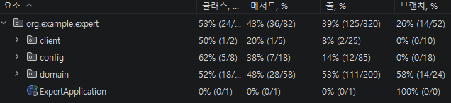
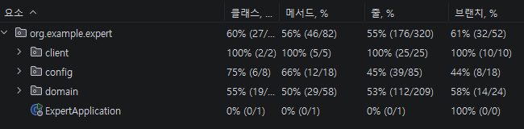

# Spring Advanced

Spring Boot 기반의 일정 관리 API 프로젝트입니다.

JWT 인증, 사용자 권한 관리, 일정/댓글/담당자 기능을 구현하고, N+1 문제 개선, API 로깅, 테스트 커버리지 개선을 함께 진행했습니다.

## 목차

- [프로젝트 소개](#프로젝트-소개)
- [기술 스택](#기술-스택)
- [주요 기능](#주요-기능)
- [프로젝트 구조](#프로젝트-구조)
- [실행 방법](#실행-방법)
- [API 기능 요약](#api-기능-요약)
- [주요 개선 내용](#주요-개선-내용)
- [테스트 커버리지](#테스트-커버리지)
- [트러블슈팅 및 학습 기록](#트러블슈팅-및-학습-기록)
- [회고](#회고)

## 프로젝트 소개

이 프로젝트는 Spring Boot를 기반으로 한 일정 관리 API입니다.

사용자는 회원가입과 로그인을 통해 JWT를 발급받고, 인증된 사용자는 일정을 생성하거나 댓글을 작성할 수 있습니다. 일정 작성자는 담당자를 등록할 수 있으며, 관리자 권한을 가진 사용자는 일부 관리자 API를 사용할 수 있습니다.

과제 진행 과정에서 단순 기능 구현뿐 아니라 코드 구조 개선, 예외 응답 일관성, N+1 문제 해결, API 로깅, 테스트 커버리지 개선까지 함께 다뤘습니다.

## 기술 스택

| 구분 | 기술 |
| --- | --- |
| Language | Java 17 |
| Framework | Spring Boot 3.3.3 |
| ORM | Spring Data JPA, Hibernate |
| Database | H2, MySQL |
| Authentication | JWT |
| Validation | Bean Validation |
| Test | JUnit 5, Mockito |
| Build Tool | Gradle |
| Logging / AOP | Spring AOP, Interceptor |

## 주요 기능

- 회원가입 / 로그인
- JWT 기반 인증
- 사용자 정보 조회 및 비밀번호 변경
- 일정 생성 / 조회
- 댓글 생성 / 조회 / 관리자 삭제
- 일정 담당자 등록 / 조회 / 삭제
- 관리자 API 접근 제어
- 관리자 API 접근 및 요청/응답 로깅
- 테스트 커버리지 개선

## 프로젝트 구조

```text
src
├── main
│   ├── java
│   │   └── org.example.expert
│   │       ├── client
│   │       ├── config
│   │       └── domain
│   │           ├── auth
│   │           ├── comment
│   │           ├── common
│   │           ├── manager
│   │           ├── todo
│   │           └── user
│   └── resources
│       └── application.yml
└── test
    └── java
        └── org.example.expert
```

## 실행 방법

### 1. 프로젝트 클론

```bash
git clone https://github.com/w00lam/spring-advanced.git
cd spring-advanced
```

### 2. 테스트 실행

```bash
./gradlew test
```

Windows 환경에서는 다음 명령어를 사용할 수 있습니다.

```powershell
.\gradlew.bat test
```

### 3. 애플리케이션 실행

```bash
./gradlew bootRun
```

Windows 환경:

```powershell
.\gradlew.bat bootRun
```

기본 실행 포트는 `8080`입니다.

```text
http://localhost:8080
```

## API 기능 요약

### Auth

| Method | URL | 설명 |
| --- | --- | --- |
| POST | `/auth/signup` | 회원가입 |
| POST | `/auth/signin` | 로그인 |

### User

| Method | URL | 설명 |
| --- | --- | --- |
| GET | `/users/{userId}` | 사용자 조회 |
| PUT | `/users` | 비밀번호 변경 |
| PATCH | `/admin/users/{userId}` | 사용자 권한 변경 |

### Todo

| Method | URL | 설명 |
| --- | --- | --- |
| POST | `/todos` | 일정 생성 |
| GET | `/todos` | 일정 목록 조회 |
| GET | `/todos/{todoId}` | 일정 단건 조회 |

### Comment

| Method | URL | 설명 |
| --- | --- | --- |
| POST | `/todos/{todoId}/comments` | 댓글 생성 |
| GET | `/todos/{todoId}/comments` | 댓글 목록 조회 |
| DELETE | `/admin/comments/{commentId}` | 관리자 댓글 삭제 |

### Manager

| Method | URL | 설명 |
| --- | --- | --- |
| POST | `/todos/{todoId}/managers` | 담당자 등록 |
| GET | `/todos/{todoId}/managers` | 담당자 목록 조회 |
| DELETE | `/todos/{todoId}/managers/{managerId}` | 담당자 삭제 |

## 주요 개선 내용

### 프로젝트 실행 설정 복구

초기 실행 시 Gradle wrapper 설정과 애플리케이션 설정이 누락되어 실행이 실패했습니다.

개선 내용:

- `gradle-wrapper.properties` 복구
- `application.yml` 추가
- JWT secret 설정 추가
- H2 datasource 설정 추가
- JWT 의존성 범위 수정

### AuthUserArgumentResolver 등록

`@Auth AuthUser` 파라미터가 정상 동작하도록 `AuthUserArgumentResolver`를 Spring MVC에 등록했습니다.

개선 내용:

- `AuthUserArgumentResolver`를 Bean으로 등록
- `WebConfig`에서 `addArgumentResolvers()`로 resolver 추가
- JWT Filter에서 request attribute로 저장한 사용자 정보를 컨트롤러 파라미터로 주입

### 코드 개선

Early Return, 불필요한 `if-else` 제거, Bean Validation 적용을 진행했습니다.

개선 내용:

- 회원가입 중복 이메일 검증을 먼저 처리
- `WeatherClient`의 불필요한 `else` 제거
- 비밀번호 형식 검증을 DTO의 Bean Validation으로 이동

### N+1 문제 개선

JPQL `fetch join` 기반 조회를 `@EntityGraph` 기반 조회로 변경했습니다.

개선 내용:

- `TodoRepository`의 fetch join 제거
- `@EntityGraph(attributePaths = {"user"})` 적용
- Todo 조회 시 user 연관 엔티티를 함께 로딩

### 테스트 코드 개선

기존 실패 테스트를 실제 서비스 동작과 맞게 수정했습니다.

개선 내용:

- `PasswordEncoderTest`의 `matches()` 인자 순서 수정
- Manager 목록 조회 예외 테스트 수정
- Comment 등록 실패 예외 타입 수정
- `todo.user == null` 케이스에서 NPE 대신 도메인 예외 발생하도록 수정

### API 로깅

Interceptor와 AOP를 활용해 관리자 API 접근 제어와 로깅을 구현했습니다.

개선 내용:

- `AdminInterceptor`로 `/admin/**` 접근 권한 확인
- 관리자 접근 시 요청 시각과 URL 로깅
- `AdminApiLoggingAspect`로 관리자 API 요청/응답 로깅
- 요청 사용자 ID, 요청 시각, URL, RequestBody, ResponseBody 기록

### 검증 정책 및 매핑 개선

도전 과제로 직접 문제를 정의하고 개선했습니다.

개선 내용:

- `@Valid` 실패 응답 형식 통일
- 회원가입 비밀번호 형식 검증 추가
- `LocalDateTime` 필드의 불필요한 `@Temporal` 제거

## 테스트 커버리지

IntelliJ IDEA의 `Run with Coverage`를 사용해 테스트 커버리지를 확인했습니다.

1차 측정 결과 `client`, `config` 계층의 Line Coverage와 Branch Coverage가 낮아, 해당 영역을 중심으로 테스트 케이스를 추가했습니다.

### 커버리지 개선 결과

| 측정 단계 | Line Coverage | Condition/Branch Coverage |
| --- | ---: | ---: |
| 1차 측정 | 39% | 26% |
| 2차 측정 | 55% | 61% |

### 1차 커버리지 결과



### 2차 커버리지 결과



### 보강한 테스트

- `WeatherClientTest`: 날씨 조회 성공, 응답 실패, 응답 body null, 빈 배열, 오늘 날짜 데이터 없음 케이스 검증
- `JwtUtilTest`: 토큰 생성, claim 추출, Bearer 토큰 추출 성공/실패 케이스 검증
- `AuthUserArgumentResolverTest`: `@Auth`와 `AuthUser` 조합의 정상/오류 케이스 검증
- `AuthServiceTest`, `UserServiceTest`: 서비스 계층의 성공 흐름과 주요 예외 분기 보강

## 트러블슈팅 및 학습 기록

- [EntityGraph와 페이징을 같이 사용할 때 주의할 점](https://w00lam.github.io/posts/EntityGraph%EC%99%80-%ED%8E%98%EC%9D%B4%EC%A7%95%EC%9D%84-%EA%B0%99%EC%9D%B4-%EC%82%AC%EC%9A%A9%ED%95%A0-%EB%95%8C-%EC%A3%BC%EC%9D%98%ED%95%A0-%EC%A0%90/)

## 회고

### 필수 기능을 개발하면서 느끼고 생각한 것들

이번 과제를 진행하면서 단순히 기능을 구현하는 것보다, Spring MVC가 요청을 처리하는 흐름을 이해하는 것이 중요하다는 것을 느꼈다.

특히 `AuthUserArgumentResolver`를 구현하면서 ArgumentResolver가 컨트롤러 메서드의 파라미터 값을 어떻게 자동으로 만들어주는지 알 수 있었다. `@Auth AuthUser authUser`처럼 작성하면 Spring이 알아서 값을 넣어주는 것처럼 보이지만, 실제로는 `AuthUserArgumentResolver`가 `@Auth` 어노테이션과 `AuthUser` 타입을 확인한 뒤 request attribute에서 `userId`, `email`, `userRole` 값을 꺼내 `AuthUser` 객체를 생성해주는 구조였다.

이 과정에서 어노테이션 자체가 기능을 수행하는 것이 아니라, 어노테이션은 단순한 표식이고 그 표식을 해석하는 코드가 필요하다는 점을 이해했다. `@Retention(RetentionPolicy.RUNTIME)`도 중요했다. 리플렉션은 실행 중에 클래스, 메서드, 파라미터, 어노테이션 정보를 코드로 들여다보는 기능인데, `RUNTIME`으로 설정하지 않으면 실행 중에 `@Auth` 정보를 Spring이 확인할 수 없다. 즉, ArgumentResolver가 `@Auth`가 붙은 파라미터인지 판단하려면 어노테이션 정보가 런타임까지 유지되어야 한다.

또한 N+1 문제를 해결하는 과정에서 `fetch join`과 `@EntityGraph`의 차이를 다시 생각해볼 수 있었다. 이번 과제에서는 JPQL `fetch join`을 `@EntityGraph` 기반으로 변경했는데, `@EntityGraph`도 연관 엔티티를 함께 조회할 수 있어 N+1 문제를 완화하는 데 사용할 수 있었다. 다만 `@EntityGraph` 자체는 페이징과 함께 사용할 수 있지만, 컬렉션처럼 ToMany 관계를 fetch하는 경우에는 페이징이나 성능 문제가 생길 수 있다는 점도 알게 되었다.

이 부분은 따로 정리할 필요가 있다고 느껴 블로그 글로도 작성했다.

- [EntityGraph와 페이징을 같이 사용할 때 주의할 점](https://w00lam.github.io/posts/EntityGraph%EC%99%80-%ED%8E%98%EC%9D%B4%EC%A7%95%EC%9D%84-%EA%B0%99%EC%9D%B4-%EC%82%AC%EC%9A%A9%ED%95%A0-%EB%95%8C-%EC%A3%BC%EC%9D%98%ED%95%A0-%EC%A0%90/)

### 도전 기능을 개발하면서 느끼고 생각한 것들

도전 기능을 진행하면서는 테스트와 커버리지에 대해 많이 생각하게 되었다.

처음 테스트 커버리지를 확인했을 때 Line Coverage와 Branch Coverage가 생각보다 낮았다. 특히 `client`, `config` 계층의 커버리지가 낮았고, 이 영역은 외부 API 호출, JWT 처리, ArgumentResolver처럼 조건 분기나 예외 흐름이 있는 코드가 많았다. 그래서 단순히 성공 케이스만 테스트하는 것이 아니라, 실패 응답, 빈 응답, 잘못된 토큰 형식, 어노테이션 조합 오류 같은 예외 케이스도 함께 테스트해야 커버리지가 의미 있게 올라간다는 것을 알게 되었다.

다만 테스트 커버리지는 무조건 100%를 목표로 해야 하는 지표는 아니라고 느꼈다. 커버리지를 높이는 것 자체보다 중요한 것은 중요한 비즈니스 흐름과 조건 분기가 테스트되고 있는지 확인하는 것이라고 생각했다. Line Coverage는 어떤 코드가 실행되었는지를 보여주고, Branch Coverage는 조건문의 참/거짓 흐름이 테스트되었는지를 보여준다. 따라서 두 지표를 함께 보면서 테스트가 부족한 영역을 찾는 용도로 활용하는 것이 더 현실적이라고 느꼈다.

이번에는 커버리지가 낮은 영역을 먼저 확인하고, 그 영역에 테스트를 보강한 뒤 다시 커버리지를 확인했다. 이 과정을 통해 테스트 커버리지는 결과 점수라기보다, 테스트가 부족한 부분을 찾기 위한 피드백 도구에 가깝다는 생각을 하게 되었다.
